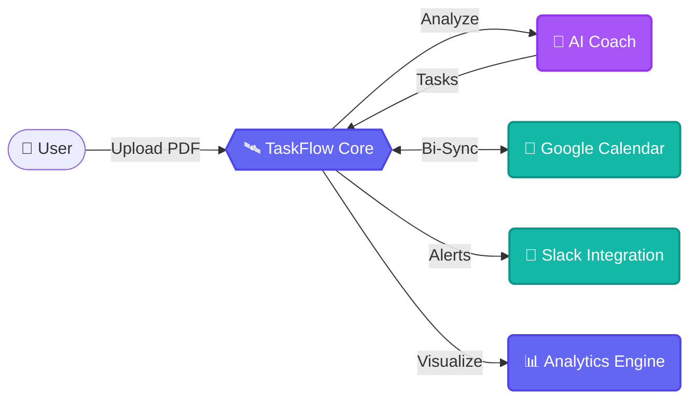

# 🛰️ TaskFlow: The AI-Powered Productivity Ecosystem

**TaskFlow** is an elite, data-driven task management platform engineered for high-performance teams. It transcends traditional list-making by integrating an **AI Productivity Coach** (Gemini LLM), bi-directional **Google Ecosystem** synchronization, and real-time **Workload Balancing** analytics.

---

## 💎 The TaskFlow Advantage

TaskFlow is designed for the modern professional who demands more than just a checkbox. Our ecosystem bridges the gap between raw data (PDFs/Requirements) and actionable results.

### 🌌 Core Technology Pillars
| Pillar | Technology | Value Proposition |
| :--- | :--- | :--- |
| **🧠 Intelligence** | Google Gemini 1.5 Flash | Instant task extraction from complex PDF documentation. |
| **🔄 Sync** | Bi-directional Webhooks | Real-time mapping to Google Calendar & Slack workspaces. |
| **📊 Analytics** | Recharts & AI Logic | Data-driven team health scoring and workload balancing. |
| **🛡️ Security** | MFA & JWT Rotation | Enterprise-grade protection with audit-trail logging. |

---

## 🔄 Integrated Ecosystem flow

---

## ✨ Enterprise Features

- **🤖 AI-Powered PDF Ingestion**: Transform syllabi, PRDs, or security audits into structured milestones instantly.
- **📅 Google Calendar Bi-Sync**: Tasks appear as events automatically; updates in TaskFlow reflect in your calendar.
- **💬 Slack Productivity Coach**: Nightly AI-driven performance summaries and real-time high-priority overdue pings.
- **📊 Team Workload Balancing**: Real-time "Health Scores" based on task priority, bandwidth, and upcoming deadlines.
- **🔐 Multi-Factor Security (MFA)**: Secure your workspace with TOTP-based authentication.
- **🔗 Advanced Dependencies**: Visualize bottlenecks with built-in task blockers and Gantt-style logic.
- **💬 Collaboration & Mentions**: Full comment threads with @mention notifications and real-time audit logs.

---

## 🛠️ Architecture & Setup

### 📂 Directory Map
- **`frontend/`**: Next.js 14 App Router (Tailwind + Lucide + Framer).
- **`backend/`**: Node.js 20, Express, Prisma ORM (Neon Cloud DB), `node-cron`.
- **`.agent/workflows/`**: Professional operational guides for DevOps and Setup.

### 🚀 Rapid Deployment
1. **Clone**: `git clone https://github.com/Saanvirajput/task-manager.git`
2. **Backend**: `npm install && npx prisma db push && npm run start`
3. **Frontend**: `npm install && npm run dev`

---
> [!IMPORTANT]
> **TaskFlow** is pre-configured for **Railway.app**. Refer to `/.agent/workflows/deploy.md` for the unified deployment strategy.

Built with ✨ by **Saanvi Rajput**
