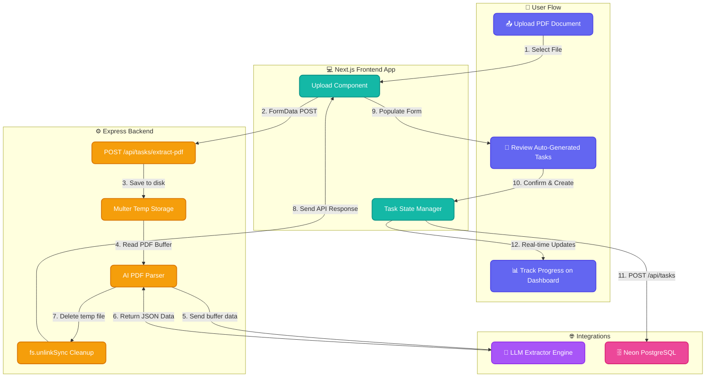
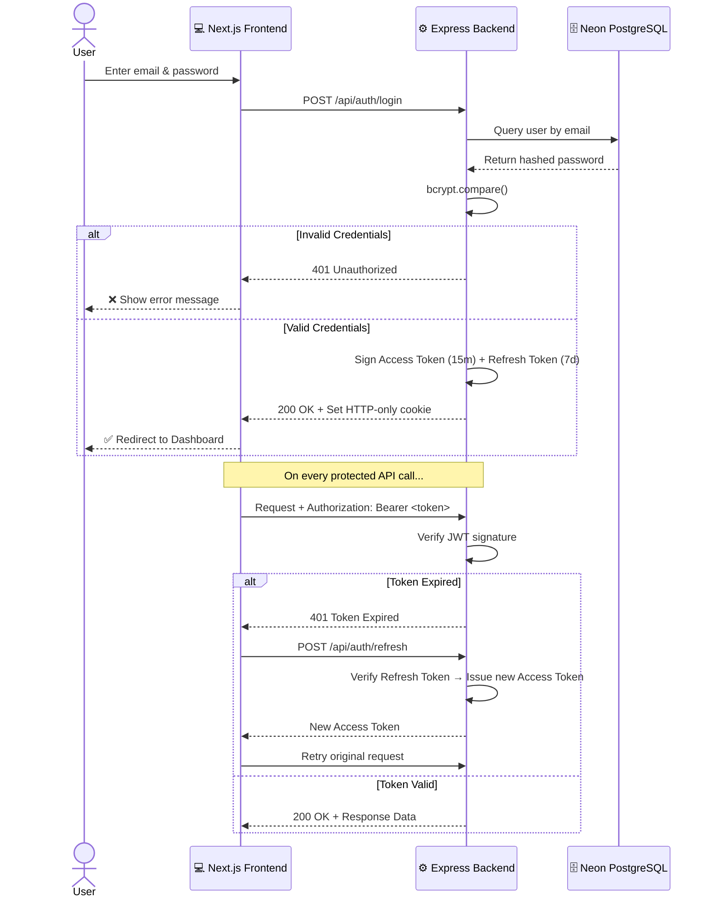
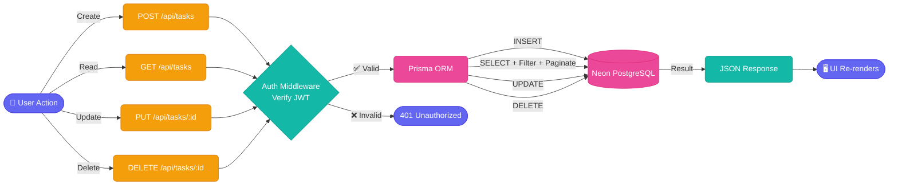

# 🛰️ TaskFlow: Data-Driven Task Management System

A premium, full-stack task management platform designed for efficiency and data-driven insights. Built with a modern tech stack and integrated with **Neon Cloud PostgreSQL**.

## 🔄 System Architecture & AI Workflow



## ✨ Features

- **🚀 Performance Dashboard**: Real-time analytics on task completion rates and creation trends.
- **🛡️ Secure Authentication**: JWT-based auth with Access & Refresh token rotation.
- **📊 Real-time Analytics**: Interactive charts powered by Recharts showing productivity trends.
- **⚡ Fast Search & Filter**: Instant search with status and priority filtering for high-volume task lists.
- **☁️ Cloud Integrated**: Pre-configured for serverless Neon PostgreSQL.
- **🎭 Modern UI**: Clean, ClickUp-inspired interface with responsive design and subtle micro-animations.

## 🎯 Use Cases

- **Personal Task Tracking**: Stay on top of daily to-dos with a clean, distraction-free interface.
- **Productivity Analysis**: Use the built-in charts to visualize your work patterns and improve efficiency.
- **Priority Management**: Focus on what matters most using High/Medium/Low priority tagging.
- **Goal Visualization**: Monitor your completion rates to maintain momentum on long-term projects.

## 🛠️ Tech Stack

- **Frontend**: Next.js 14, Tailwind CSS, Recharts, Lucide Icons.
- **Backend**: Node.js, Express, Prisma ORM, TypeScript.
- **Database**: Neon Cloud PostgreSQL.
- **Auth**: JWT, Bcrypt.

## 🚀 Quick Start

### 1. Clone & Install
```bash
git clone https://github.com/Saanvirajput/task-manager.git
cd task-manager
npm run install:all
```

### 2. Environment Setup
Create a `.env` file in the `backend/` directory:
```env
DATABASE_URL="your_neon_postgresql_url"
JWT_ACCESS_SECRET="your_secret"
JWT_REFRESH_SECRET="your_secret"
```

### 3. Database Sync & Seed
```bash
cd backend
npx prisma db push
npm run seed
```

### 4. Run Development
In the root directory:
```bash
npm run dev
```

## 🔐 Authentication Flow



## 📋 Task Lifecycle Flow



## 🔑 Test Account
- **Email**: `test@example.com`
- **Password**: `password123`

---
Built with ✨ by Saanvi Rajput
