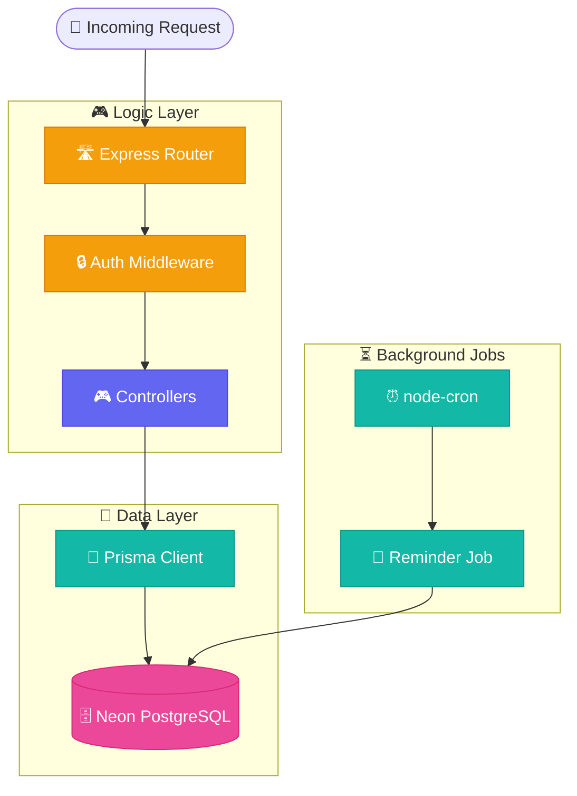

# ⚙️ TaskFlow Backend: Logic & Persistence Layer

The powerhouse of the TaskFlow system, built with Node.js and TypeScript. This backend manages secure authentication, AI-powered data extraction, and real-time task analytics.

## 🏗️ Backend Architecture



## 🚀 Key Features
- **🔐 Secure Auth**: JWT-based authentication with access/refresh token rotation (Bcrypt hashing).
- **🧠 AI Extraction**: Integrated with Google Gemini 1.5 Flash for intelligent PDF-to-Task parsing.
- **⏰ Automations**: Background cron jobs for automated task reminders and overdue alerts.
- **📊 Analytics Engine**: Custom aggregation logic for real-time productivity tracking.
- **🛡️ Validation**: Strict schema validation using Zod for all incoming payload data.

## 🛠️ Tech Stack
- **Runtime**: Node.js & TypeScript
- **Framework**: Express.js
- **ORM**: Prisma (PostgreSQL)
- **Database**: Neon Cloud PostgreSQL
- **AI**: Google Generative AI (Gemini Flash)
- **Jobs**: Node-Cron

## 🚥 Quick Setup

### 1. Installation
```bash
npm install
```

### 2. Environment Variables
Create a `.env` file based on `.env.example`:
```env
DATABASE_URL="postgresql://..."
JWT_ACCESS_SECRET="your_secret"
JWT_REFRESH_SECRET="your_secret"
GEMINI_API_KEY="your_google_ai_key"
```

### 3. Sync Database
```bash
npx prisma db push
npm run seed
```

### 4. Run Development
```bash
npm run dev
```

## 🛰️ API Reference (Core)

| Method | Endpoint | Description |
| :--- | :--- | :--- |
| `POST` | `/api/auth/login` | Authenticate user & issue tokens |
| `POST` | `/api/tasks/extract-pdf` | AI extraction from PDF upload |
| `GET` | `/api/tasks` | Fetch user tasks (with pagination/filters) |
| `GET` | `/api/analytics/overview` | Productivity metrics & trends |
| `GET` | `/health` | Service health status |

---
Built with ✨ by Saanvi Rajput
