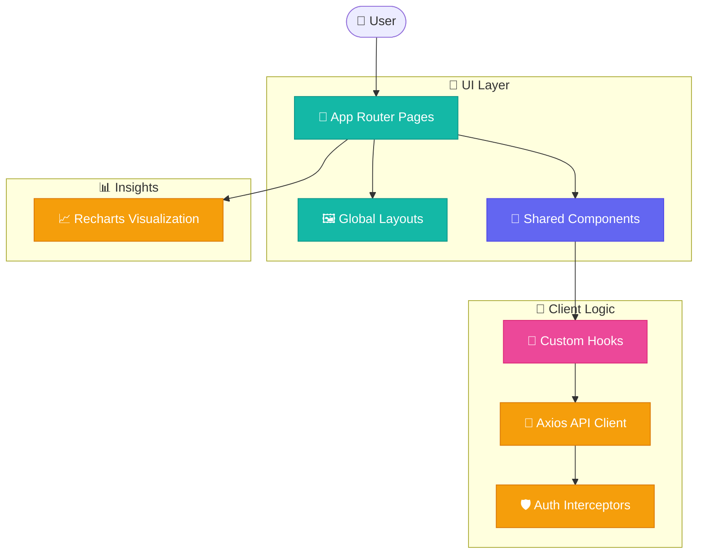

# 💻 TaskFlow Frontend: Premium User Interface

A modern, high-performance task management interface built with Next.js 14 and Tailwind CSS. Featuring real-time analytics, smooth transitions, and a clean "ClickUp-inspired" design.

## 🏗️ Frontend Architecture



## 🚀 Key Features
- **📊 Real-time Dashboard**: Interactive charts showing creation trends and completion rates.
- **🤖 AI Task Import**: Seamless PDF upload interface for automated task generation.
- **🔔 Notification System**: Intelligent toast alerts and a live notification tray.
- **🌗 Responsive Design**: Fully optimized for mobile, tablet, and desktop viewing.
- **🚦 Priority Tracking**: Visual status indicators for task urgency and progress.
- **💨 Fast Loading**: Optimized Next.js App Router for near-instant transitions.

## 🛠️ Tech Stack
- **Core**: Next.js 14 (App Router)
- **Language**: TypeScript
- **Styling**: Tailwind CSS
- **State/API**: Axios & React Hooks
- **Charts**: Recharts
- **Icons**: Lucide React

## 🚥 Quick Setup

### 1. Installation
```bash
npm install
```

### 2. Environment Variables
Create a `.env.local` file:
```env
NEXT_PUBLIC_API_URL=https://your-backend-url.up.railway.app/api
```

### 3. Run Development
```bash
npm run dev
```

## 📂 Key Directories
- `src/app`: Page routes (Dashboard, Login, Tasks)
- `src/components`: Reusable UI elements (Modals, Charts, Sidebar)
- `src/lib`: API clients and authentication utilities
- `src/hooks`: Custom business logic (Auth, Notifications)

---
Built with ✨ by Saanvi Rajput
